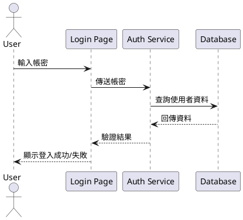
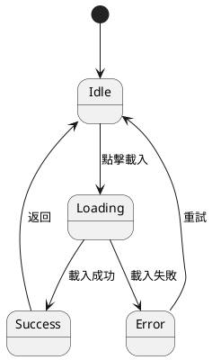
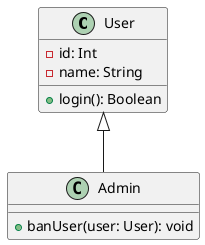
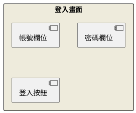

# PlantUML 使用指南

## 背景

PlantUML 是一種用來撰寫 UML 圖表的輕量級語法工具，搭配 VS Code 使用可以快速畫出各種 UML 圖，例如序列圖、類別圖、狀態圖與使用者介面圖等。

---

## 前置工作：VS Code 安裝 PlantUML 插件

1. 開啟 VS Code。
2. 點選左側 Extensions (擴充功能)。
3. 搜尋 `PlantUML` 並點選安裝。
4. 建立 `.puml` 檔案，例如 `example.puml`。
5. 建議同時安裝 Graphviz，以支援圖形渲染（可用 Homebrew 安裝：`brew install graphviz`）。

---

## 類別

### 1. 序列圖（Sequence Diagram）

> **使用時機：**
>
> 適合描述物件間的訊息傳遞流程，通常用於展示某個場景下的互動，例如登入流程、資料查詢等。

---

### 2. 狀態圖（State Diagram）

> **使用時機：**
>
> 適合描述一個系統或元件隨著事件變化時的狀態遷移，例如使用者帳號狀態（啟用、停用、刪除）。

---

### 3. 類別圖（Class Diagram）

> **使用時機：**
>
> 適合用來描述物件導向系統中各個類別的結構、屬性與方法，及其間的繼承、關聯與依賴關係。

---

### 4. 使用者介面圖（User Interface Diagram）

> **使用時機：**
>
> 適合初步規劃畫面架構與元件關係，可用來展示 UI 介面流程或雛型。

---

## 補充

- 可使用 `Alt + D` 快速預覽圖（需安裝插件支援）。
- `.puml` 檔案可以直接用擴充套件轉成 PNG 或 SVG 圖片。
- 建議版本控管與 Markdown 說明一起管理，方便團隊協作。
